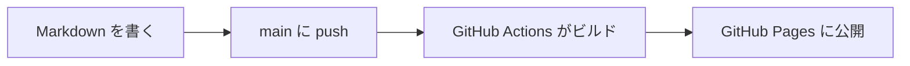

<header-table/>

# VuePress の拡張記法

このテンプレートは VuePress という仕組みでサイトを組み立てています。
そのため、標準の Markdown にはない記法がいくつか使えます。

::: warning 他のツールにコピーしても動きません
この章で説明する記法は、このサイト（VuePress）でのみ有効です。
GitHub の画面や他のツールに貼り付けても、そのままの文字として表示されます。
:::

[[toc]]

## 注意書きボックス

`:::` で囲むと、色のついたボックスになります。
先頭行に種類とタイトルを書き、最後の行を `:::` で閉じます。タイトルは省略できます。

**書き方:**

```markdown
::: tip 覚えておくと便利です
役に立つ補足を書きます。
:::
```

**表示結果:**

::: tip 覚えておくと便利です
役に立つ補足を書きます。
:::

::: info 情報
中立的な補足を書きます。
:::

::: warning 注意
読み飛ばすと失敗する可能性がある内容を書きます。
:::

::: danger 警告
データが壊れるなど、取り返しがつかない操作の警告を書きます。
:::

::: details 折りたたみ（クリックで開きます）
`details` を使うと、クリックするまで中身が隠れます。
長い補足や、上級者向けの説明を入れるときに便利です。
:::

**使い分けの目安:**

| 種類 | 色 | 使いどころ |
|------|------|------|
| `tip` | 緑 | 知っていると得をする補足 |
| `info` | 青 | 中立的な補足情報 |
| `warning` | 黄 | 読み飛ばすと失敗しやすい注意点 |
| `danger` | 赤 | 取り返しのつかない操作への警告 |
| `details` | 灰 | 折りたたんで隠したい長い補足 |

## コードブロックの強化

[基本記法](/guide/01-basic-syntax/)で説明したコードブロックには、
このテンプレートでは自動的に次の機能が付きます。

- 行番号の表示
- 右上のコピーボタン
- 言語名に応じた色分け

### 特定の行を強調する

言語名の後ろに `{}` で行番号を書くと、その行が強調されます。
「ここを書き換えてください」と示したいときに使います。

**書き方:**

````markdown
```js{2,4-5}
const config = {
  title: 'ここを書き換える',
  description: '説明文',
  // 4行目
  // 5行目
}
```
````

**表示結果:**

```js{2,4-5}
const config = {
  title: 'ここを書き換える',
  description: '説明文',
  // 4行目
  // 5行目
}
```

`{2}` は2行目だけ、`{4-5}` は4行目から5行目まで、`{2,4-5}` はその両方を指します。

## タブ切り替え

環境ごとに手順が違う場合、タブで切り替えられます。
`@tab` で区切り、`@tab:active` を付けたタブが最初に開きます。

**書き方:**

```markdown
::: tabs
@tab Windows
PowerShell を開いてコマンドを実行します。

@tab:active macOS
ターミナルを開いてコマンドを実行します。
:::
```

**表示結果:**

::: tabs
@tab Windows
PowerShell を開いてコマンドを実行します。

@tab:active macOS
ターミナルを開いてコマンドを実行します。
:::

### コードだけを切り替える

コードブロックだけを並べる場合は `code-tabs` を使います。

**書き方:**

````markdown
::: code-tabs
@tab npm
```bash
npm install
```

@tab yarn
```bash
yarn install
```
:::
````

**表示結果:**

::: code-tabs
@tab npm
```bash
npm install
```

@tab yarn
```bash
yarn install
```
:::

::: tip 複数のタブを連動させる
`::: tabs#os` のように名前を付けると、同じ名前のタブがページ全体で連動します。
1つのタブで「Windows」を選ぶと、他のタブもすべて「Windows」に切り替わります。
:::

## 図を書く

図も Markdown のテキストとして書けます。画像ファイルを管理する必要がありません。

### Mermaid

` ```mermaid ` で囲みます。フローチャート、シーケンス図、ガントチャートなどが書けます。

**書き方:**

````markdown

````

**表示結果:**


### PlantUML

PlantUML は書き方が違います。**コードブロックで囲まず、`@startuml` と `@enduml` を直接書きます。**

**書き方:**

```text
@startuml
著者 -> リポジトリ : push
リポジトリ -> Actions : 起動
Actions -> Pages : 公開
@enduml
```

**表示結果:**

@startuml
著者 -> リポジトリ : push
リポジトリ -> Actions : 起動
Actions -> Pages : 公開
@enduml

::: warning PlantUML は外部サーバーで描画されます
PlantUML の図は、閲覧時に外部の描画サーバーへ接続して画像を取得します。
インターネットに接続できない環境では表示されません。
閉域網で公開する場合は、Mermaid を使ってください。Mermaid はブラウザ内で描画されます。
:::

## 絵文字

`:` で囲んだ名前が絵文字になります。

**書き方:**

```markdown
完了しました :tada: 準備はいいですか :rocket:
```

**表示結果:**

完了しました :tada: 準備はいいですか :rocket:

よく使う名前は `:smile:` :smile: 、`:warning:` :warning: 、`:bulb:` :bulb: 、`:heart:` :heart: です。
絵文字をそのまま入力しても表示できるので、好きなほうを使ってください。

## アイコン

`::` で囲むと、文中にアイコンを表示できます。
名前は [Iconify](https://icon-sets.iconify.design/) で検索できるアイコン名です。

**書き方:**

```markdown
::mdi:folder-outline:: フォルダを開きます。
::mdi:alert-circle-outline /orange:: 色を指定できます。
::mdi:check-circle-outline =24:: 大きさを指定できます。
```

**表示結果:**

::mdi:folder-outline:: フォルダを開きます。

::mdi:alert-circle-outline /orange:: 色を指定できます。

::mdi:check-circle-outline =24:: 大きさを指定できます。

**ポイント:**

- アイコン名の後ろに半角スペースを空けて `/色名` と書くと色を、`=数値` と書くと大きさ（px）を指定できる
- 絵文字と違い、線の太さや色をそろえられるため、UI の説明に向く

::: warning アイコンも外部から読み込まれます
アイコンの画像データは、閲覧時に外部の配信サーバーから取得されます。
インターネットに接続できない環境では表示されません。
閉域網で公開する場合は、絵文字を使ってください。絵文字は文字として埋め込まれます。
:::

## 目次の自動生成

`[[toc]]` と書いた場所に、そのページの見出しから目次が作られます。
このページの冒頭にも入っています。

**書き方:**

```markdown
[[toc]]
```

::: tip ページ右側の目次とは別ものです
ページ右側には常に目次が表示されます。`[[toc]]` は本文中に目次を置きたいときに使います。
長いページの冒頭に置くと、読者が全体像をつかみやすくなります。
:::

## チェックリスト

`- [ ]` と `- [x]` でチェックボックスが書けます。手順の確認表に便利です。

**書き方:**

```markdown
- [x] 環境を準備した
- [x] ローカルで表示を確認した
- [ ] 校正を実行した
```

**表示結果:**

- [x] 環境を準備した
- [x] ローカルで表示を確認した
- [ ] 校正を実行した

## 画像に枠線を付ける

背景が白い画面のスクリーンショットは、本文との境目がわかりません。
画像のパスの末尾に `#bordered` を付けると、枠線が付きます。

**書き方:**

```markdown

```

**表示結果:**


## 次に読む

記法の説明はここまでです。
新しいページを作るときに必要な設定は、[3. フロントマターとコンポーネント](/guide/03-frontmatter/)で説明します。

<credit-footer/>
