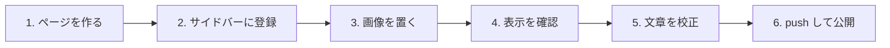

<header-table/>

# 執筆から公開までの流れ

ここまでで「どう書くか」はわかりました。
この章では「書いたものをどうやって公開するか」を、最初から最後まで通して説明します。



[[toc]]

## 0. 準備

最初の1回だけ、次のコマンドを実行します。Node.js のバージョン24以上が必要です。

```bash
npm install
```

執筆中は、開発サーバーを起動したままにしておきます。

```bash
npm run dev
```

ブラウザで `http://localhost:8080/` を開くと、編集した内容がすぐに反映されます。

## 1. ページを作る

`docs/` の下にディレクトリを作り、その中に `README.md` を置きます。
**ディレクトリの場所が、そのまま公開される URL になります。**

| ファイルの場所 | 公開される URL |
|------|------|
| `docs/README.md` | `/` |
| `docs/guide/README.md` | `/guide/` |
| `docs/guide/04-workflow/README.md` | `/guide/04-workflow/` |
| `docs/spec/adr.md` | `/spec/adr.html` |

::: tip ディレクトリ + README.md をおすすめします
`docs/guide/setup.md` でもページは作れますが、URL が `/guide/setup.html` と `.html` 付きになります。
`docs/guide/setup/README.md` にすると URL が `/guide/setup/` になり、
そのページ専用の画像も同じディレクトリにまとめられます。
:::

**ディレクトリ名の付け方:**

- 半角英小文字、数字、ハイフンだけを使う（日本語やスペースは URL が読みにくくなる）
- 順番が決まっている章は `01-` `02-` と数字を付ける
- 中身がわかる名前にする（`page1` ではなく `basic-syntax`）

ファイルを作ったら、[3. フロントマターとコンポーネント](/guide/03-frontmatter/README.md)のテンプレートを貼り付けて書き始めます。

## 2. サイドバーに登録する

**ページを作っただけでは、サイドバーに出てきません。**
`docs/.vuepress/sidebar.js` を開き、1行追加します。

```js{9}
export const sidebar = {
  '/guide/': [
    {
      text: 'ドキュメントの書き方',
      children: [
        '/guide/',
        '/guide/01-basic-syntax/',
        '/guide/02-vuepress-syntax/',
        '/guide/03-frontmatter/',
        '/guide/04-workflow/',
      ],
    },
  ],
};
```

サイドバーに表示される名前は、各ページのフロントマター `title` から自動で取られます。
ここに書くのはパスだけです。

新しいセクション（`/guide/` `/spec/` と並ぶ階層）を作った場合は、
`docs/.vuepress/navbar.js` にも追加すると、画面上部のメニューから行けるようになります。

## 3. 画像を置く

画像の置き場所は2種類あります。使い分けは「そのページだけで使うか」で決めます。

| | そのページ専用 | サイト全体で使う |
|------|------|------|
| 置き場所 | ページと同じディレクトリの `images/` | `docs/.vuepress/public/` |
| 書き方 | `` | `` |
| 向いているもの | 手順のスクリーンショット、図 | ロゴ、ファビコン、共通の図 |

::: tip スクリーンショットには枠線を付けてください
画面の背景が白い画像は、本文との境目がわかりません。
`` のようにパスの末尾へ `#bordered` を付けると枠線が付きます。
:::

角カッコの中の説明文は省略せずに書いてください。
画像が表示できなかったときに代わりに表示され、検索や読み上げでも使われます。

## 4. 表示を確認する

`npm run dev` を起動したまま、ブラウザで次を確認します。

- [ ] サイドバーに新しいページが出ている
- [ ] ページ冒頭の表（`<header-table/>`）が正しく埋まっている
- [ ] 画像が表示されている
- [ ] 他のページへのリンクが切れていない
- [ ] 図やタブを使った場合、意図どおり表示されている

## 5. 文章を校正する

textlint が日本語の書き方をチェックします。

```bash
# チェックする
npm run textlint

# 自動で直せるものを直す
npm run textlint:fix
```

**主なチェック項目:**

| 項目 | 内容 |
|------|------|
| 文の長さ | 1文が150文字を超えていないか |
| 助詞の重複 | 「〜の〜の〜」のような重なりがないか |
| 文体の統一 | 「ですます」と「である」が混ざっていないか |
| 表記ゆれ | `prh.yml` に登録した表記と違っていないか |

::: warning 自動修正は結果を必ず確認してください
`npm run textlint:fix` は日本語を機械的に置き換えます。
意図と違う直し方をされることがあるため、実行後は `git diff` で差分を確認してください。
:::

### チェックを部分的に外す

固有名詞やコード例が誤検知される場合は、次の方法で除外します。

**その箇所だけ外す:**

```markdown
<!-- textlint-disable -->

チェックを外したい内容をここに書きます。

<!-- textlint-enable -->
```

**サイト全体で許可する単語を追加する:**

`.textlintrc` の `allow` に単語を追加します。製品名などはここに登録してください。

**表記を統一したい単語を登録する:**

`prh.yml` にルールを追加すると、表記ゆれを自動で検出・修正できます。

## 6. 公開する

コミットして `main` ブランチに push すれば完了です。

```bash
git add .
git commit -m "ドキュメントを追加"
git push origin main
```

::: tip コミット時に自動で校正が走ります
`git commit` すると、変更した Markdown に対して textlint が自動で実行されます。
エラーが残っているとコミットが中断されるので、指摘を直してからやり直してください。
:::

push したあとの流れは自動です。

1. GitHub Actions の `docs` ワークフローが起動する
2. VuePress がサイトをビルドする
3. GitHub Pages に公開される

公開結果はリポジトリの **Actions** タブで確認できます。
ビルドに失敗した場合は、そこにエラー内容が表示されます。

::: warning 最初の1回だけ設定が必要です
リポジトリの **Settings → Pages → Build and deployment → Source** を
**GitHub Actions** に変更してください。
初期値の「Deploy from a branch」のままだと、公開に失敗します。
:::

## 困ったときは

| 症状 | 原因として多いもの |
|------|------|
| サイドバーに出てこない | `sidebar.js` に追加していない |
| ページ冒頭の表が空になる | フロントマターの `description` などが未記入 |
| 画像が表示されない | パスの書き方（`./` と `/` の取り違え） |
| ビルドが失敗する | `<header-table/>` の閉じスラッシュ漏れ、リンク切れ |
| 公開されない | Pages の Source が「GitHub Actions」になっていない |

それでも解決しない場合は、[VuePress 公式ドキュメント](https://v2.vuepress.vuejs.org/)を参照してください。

<credit-footer/>
