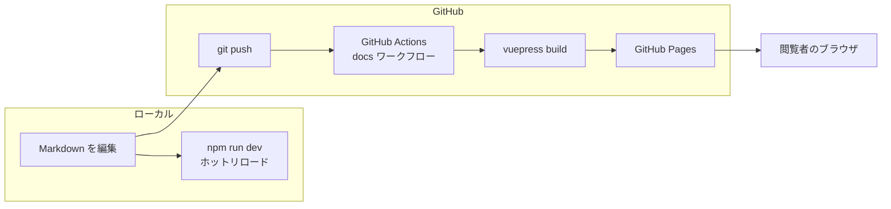

<header-table/>

# アーキテクチャ設計書

この文書は、**このテンプレートそのものの設計書**です。
仕組みを変更したい場合や、公開に失敗した原因を調べたい場合に読んでください。

[[toc]]

## 全体像

Markdown ファイルを静的な HTML に変換して配信する、静的サイト生成（SSG）構成です。
アプリケーションサーバーもデータベースも使いません。



この構成を選んだ理由は次のとおりです。

| 観点 | 内容 |
|------|------|
| 運用コスト | 配信するのは静的ファイルのみ。サーバーの保守が不要 |
| 表示速度 | 事前生成済みの HTML を返すため高速 |
| 安全性 | 実行環境を持たないため、攻撃対象になりにくい |
| 執筆しやすさ | Markdown だけで書ける。差分がテキストとしてレビューできる |

## 技術スタック

| 技術 | バージョン | 役割 |
|------|------|------|
| VuePress | 2.0.0-rc.24 | 静的サイトジェネレーター |
| Vue.js | 3.x | 画面の部品（VuePress に同梱） |
| Vite | 7.x | ビルドとホットリロード |
| Node.js | v20以上 | 実行環境 |
| Sass | 1.93.x | スタイルの記述 |
| Mermaid | 11.x | 図の描画 |
| textlint | 15.x | 日本語の校正 |
| lefthook | 2.x | コミット前フックの実行 |

### 使用しているプラグイン

| プラグイン | 役割 |
|------|------|
| `@vuepress/plugin-search` | サイト内の全文検索 |
| `@vuepress/plugin-markdown-ext` | GFM 拡張とチェックリスト |
| `@vuepress/plugin-markdown-chart` | Mermaid と PlantUML の図 |
| `@vuepress/plugin-markdown-tab` | タブ切り替え |
| `@vuepress/plugin-markdown-image` | 画像の遅延読み込みと `#bordered` |
| `@vuepress/plugin-icon` | Iconify のアイコン記法 |
| `@snippetors/vuepress-plugin-code-copy` | コードのコピーボタン |
| `markdown-it-emoji` | 絵文字記法 |

## ディレクトリ構造

```text
.
├── .github/
│   ├── workflows/docs.yml     # ビルドと公開のワークフロー
│   ├── ISSUE_TEMPLATE/        # Issue のひな形
│   ├── PULL_REQUEST_TEMPLATE.md
│   ├── copilot-instructions.md
│   ├── instructions/          # パス別の規約
│   └── agents/                # AI 向けの執筆エージェント
├── .claude/
│   └── commands/              # Claude Code の執筆コマンド
├── docs/
│   ├── .vuepress/
│   │   ├── config.js          # サイト全体の設定
│   │   ├── navbar.js          # 画面上部のメニュー
│   │   ├── sidebar.js         # サイドバー
│   │   ├── client.js          # ブラウザ側の処理
│   │   ├── components/        # 専用の表示部品
│   │   ├── styles/index.scss  # スタイルの上書き
│   │   └── public/            # サイト共通の静的ファイル
│   ├── README.md              # トップページ
│   ├── guide/                 # ドキュメントの書き方
│   └── spec/                  # 設計文書
├── .textlintrc                # 校正ルール
├── prh.yml                    # 表記ゆれの辞書
├── lefthook.yml               # コミット前フック
├── .npmrc                     # npm の設定
└── package.json
```

`docs/` 配下のディレクトリ構造が、そのまま公開される URL になります（ファイルベースルーティング）。
ルーティング用の設定ファイルはありません。

## 設定ファイルの構成

### config.js

サイト全体の設定です。役割ごとに分割しています。

| 設定 | 内容 |
|------|------|
| `base` | 公開先のサブパス。後述の「base の仕組み」を参照 |
| `title` / `description` | サイト名と説明。コピーしたら書き換える |
| `head` | ファビコンなど `<head>` に入れる要素 |
| `theme` | テーマの設定。`navbar` と `sidebar` を読み込む |
| `markdown` | Markdown の解釈方法（行番号、自動リンク、絵文字） |
| `plugins` | 前述のプラグイン群 |

### navbar.js / sidebar.js

画面上部のメニューとサイドバーの定義です。
**VuePress v2 のデフォルトテーマには、ディレクトリからサイドバーを自動生成する機能がありません。**
ページを追加したら `sidebar.js` に手動で追記する必要があります。

この制約をわかりやすくするため、`config.js` から切り出して独立したファイルにしています。

### client.js

ブラウザ側で動く処理です。2つの役割があります。

1. `components/` の Vue 部品をグローバルに登録する
2. 最終更新日時の表示形式を `YY/M/D` に整える

### components/

Markdown の中に書ける専用部品です。フロントマターの値を読んで表示します。

| 部品 | 読み取る項目 | 表示位置 |
|------|------|------|
| `header-table.vue` | `description` / `time` / `prior_knowledge` | ページ冒頭 |
| `credit-footer.vue` | `footer` | ページ末尾 |

使い方は[3. フロントマターとコンポーネント](/guide/03-frontmatter/)を参照してください。

## ビルドプロセス

### 開発モード

```bash
npm run dev
```

Vite の開発サーバーが `http://localhost:8080/` で起動します。
ファイルを保存すると、ブラウザが自動で更新されます。

### 本番ビルド

```bash
npm run build
```

`docs/.vuepress/dist/` に静的ファイルが出力されます。
このディレクトリは `.gitignore` の対象で、コミットしません。

## デプロイフロー

`main` ブランチへの push をきっかけに、`.github/workflows/docs.yml` が動きます。

| # | 処理 | 使用アクション |
|------|------|------|
| 1 | リポジトリの取得 | `actions/checkout@v4` |
| 2 | Node.js v20 の準備 | `actions/setup-node@v4` |
| 3 | 依存のキャッシュ | `actions/cache@v4` |
| 4 | 依存のインストール | `npm ci` |
| 5 | ビルド | `npm run build` |
| 6 | Pages の設定 | `actions/configure-pages@v4` |
| 7 | 成果物のアップロード | `actions/upload-pages-artifact@v3` |
| 8 | 公開 | `actions/deploy-pages@v4` |

チェックアウト時に `fetch-depth: 0` を指定しているのは、
各ページの最終更新日時を Git の履歴から取得するためです。

::: warning リポジトリ側の設定が1回だけ必要です
**Settings → Pages → Build and deployment → Source** を **GitHub Actions** にしてください。
初期値の「Deploy from a branch」のままでは、手順8で失敗します。
:::

### base の仕組み

GitHub Pages のプロジェクトサイトは `https://<組織名>.github.io/<リポジトリ名>/` で配信されます。
このとき、CSS や画像を `/assets/...` という絶対パスで参照していると、すべて404になります。

そこでビルド時に、リポジトリ名をサブパスとして渡しています。

```yaml
- name: Build
  run: npm run build
  env:
    VUEPRESS_BASE: /${{ github.event.repository.name }}/
```

`config.js` 側はこれを受け取ります。

```js
const base = process.env.VUEPRESS_BASE ?? '/'
```

この仕組みにより、**リポジトリをコピーしても設定を書き換えずに正しく公開できます。**

::: tip 独自ドメインで公開する場合
独自ドメイン、または `https://<組織名>.github.io/` の直下で公開する場合は、
`docs.yml` の `VUEPRESS_BASE` の行を削除してください。`base` は `/` になります。
:::

なお `config.js` の `head` に書くファビコンの URL は、VuePress が `base` を補完しません。
そのため `` href: `${base}favicon.svg` `` と自分で連結しています。

## 文章校正の仕組み

| ファイル | 役割 |
|------|------|
| `.textlintrc` | 校正ルールと、チェックから除外する単語 |
| `prh.yml` | 表記ゆれの辞書 |
| `lefthook.yml` | `git commit` 時に textlint を実行する設定 |

`lefthook` は `npm install` 時の `prepare` スクリプトで自動的に Git フックへ登録されます。
コミット時に変更された Markdown だけがチェックされ、エラーがあるとコミットが中断されます。

自動修正（`npm run textlint:fix`）は日本語を機械的に置換するため、フックでは実行していません。
手動で実行し、`git diff` で結果を確認する運用としています。

## 拡張する

### プラグインを追加する

```bash
npm install -D @vuepress/plugin-〇〇
```

`config.js` の `plugins` 配列に追加します。

### 表示部品を追加する

1. `docs/.vuepress/components/` に `.vue` ファイルを作る
2. `docs/.vuepress/client.js` で `app.component()` に登録する
3. Markdown の中でタグとして使う

### 見た目を変える

`docs/.vuepress/styles/index.scss` に CSS を書きます。
ダークモードに対応させる場合は `html.dark` を使って色を切り替えます。

## 既知の制約

| 制約 | 内容 | 回避方法 |
|------|------|------|
| サイドバーの手動登録 | ディレクトリからの自動生成は非対応 | `sidebar.js` に追記する |
| PlantUML の外部依存 | 閲覧時に外部の描画サーバーへ接続する | 閉域網では Mermaid を使う |
| アイコンの外部依存 | 閲覧時に外部の配信サーバーへ接続する | 閉域網では絵文字を使う |
| 依存の解決 | 一部プラグインの peer 依存が衝突する | `.npmrc` の `legacy-peer-deps=true` で回避済み |

## 参考リンク

- [VuePress v2 公式ドキュメント](https://v2.vuepress.vuejs.org/)
- [VuePress プラグイン一覧](https://ecosystem.vuejs.press/)
- [textlint 公式サイト](https://textlint.github.io/)
- [GitHub Pages ドキュメント](https://docs.github.com/pages)

<credit-footer/>
